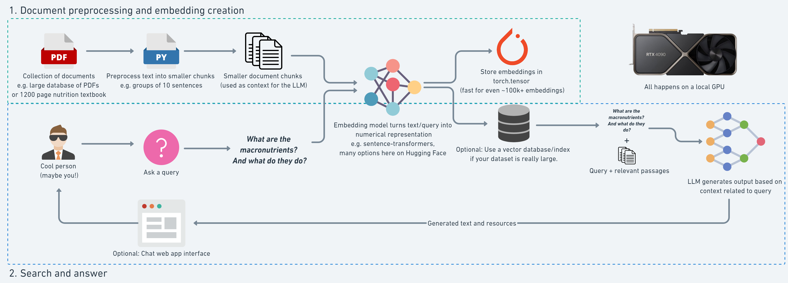

# Retrieval Augmented Generation (RAG) for PDF Question Answering

This repository implements a Retrieval Augmented Generation (RAG) system for answering questions based on PDF documents. The project leverages powerful language models and embedding techniques within Google Colab to enhance the accuracy and efficiency of question answering.

## Key Features

* **Document Processing:** Extracts text from PDFs, performs cleaning and normalization, and divides the content into manageable chunks.
* **Embedding Generation:** Utilizes pre-trained SentenceTransformer models (e.g., all-MiniLM-L6-v2) to generate embeddings for each text chunk.
* **Similarity Search:** Employs efficient similarity search techniques (e.g., dot product) to retrieve relevant text chunks based on user queries.
* **Question Answering:** (Note: This feature is currently incomplete in the Google Colab implementation due to GPU limitations)

## Technical Details

* **PDF Processing:** PyMuPDF is used for extracting text from PDF documents.
* **Text Processing:** spaCy is used for sentence segmentation.
* **Tokenization:** Hugging Face's Transformers library is used for tokenization, specifically the BERT base uncased tokenizer.
* **Embedding Models:** SentenceTransformers library provides pre-trained models for generating text embeddings.
* **Hardware Acceleration:** Attempts to leverage GPU acceleration for faster embedding generation and similarity search within Google Colab.

## Usage

1. **Open the Notebook in Google Colab:**
   Access the provided Jupyter Notebook through Google Colab.
2. **Prepare PDF Document:**
   Upload your PDF document to your Google Colab environment.
3. **Run the Notebook:**
   Execute the notebook cells sequentially to process the document, generate embeddings, and perform similarity search.

## Current Limitations

* The question answering component using a Large Language Model (LLM) is currently incomplete in the Google Colab implementation due to GPU resource constraints.

## Overcoming Limitations

Users can potentially overcome the GPU limitations by:
* Using Kaggle notebooks, which often provide more powerful GPU resources.
* Running the notebook locally on a machine with a better GPU.
* Adjusting the model size or batch processing to fit within available GPU memory.

## Future Enhancements

* **Complete LLM Integration:** Implement the question answering component with an appropriate LLM.
* **Vector Database Integration:** Explore the use of vector databases (e.g., Faiss) for efficient storage and retrieval of embeddings, especially for large datasets.
* **Fine-tuning Embedding Models:** Fine-tune embedding models on domain-specific data to improve retrieval accuracy.
* **Dynamic Chunk Sizing:** Implement adaptive chunk sizing based on content complexity and embedding model limitations.
* **User Interface:** Develop a user-friendly interface for interacting with the RAG system.
* **Optimization:** Explore methods to reduce computational requirements and optimize for environments with limited GPU resources.

## Contributing

Contributions are welcome! Feel free to open issues or submit pull requests.

## License

This project is licensed under the [MIT License](LICENSE).
